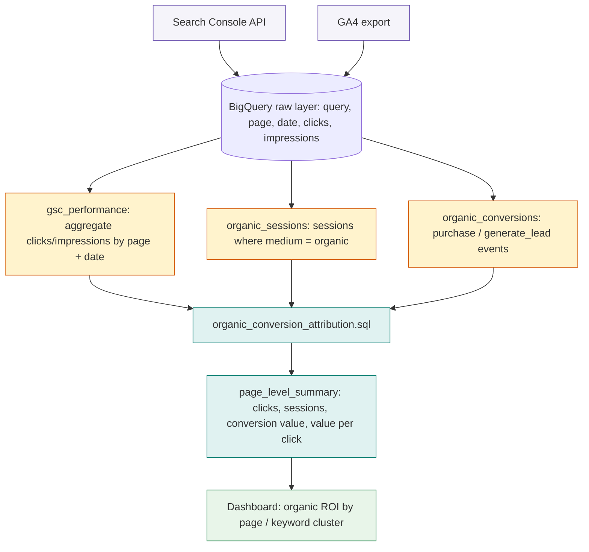

# SEO Performance Tracker

Pulls Search Console data into the warehouse and joins it against actual conversions, so organic performance gets measured by revenue impact, not just impressions and clicks.

## The problem this solves

Search Console tells you what's ranking, GA4 tells you what's converting, and almost nobody joins the two, because they live in different tools with no native connection between a search query and the revenue it eventually drove. This means organic traffic usually gets judged on volume alone, impressions, clicks, average position, when the real question a business cares about is which keywords and pages are actually driving pipeline. A keyword ranking well for high search volume but low commercial intent can look like a win in Search Console and mean nothing for the business.

## Architecture

The join happens on landing page and date rather than session ID, since Search Console has no concept of a GA4 session, it only reports aggregated query and page performance per day. That's a deliberate tradeoff: it means attribution is page-level rather than session-level, which is the right granularity for the question this toolkit answers, "which pages are worth the SEO investment," rather than individual user journeys.

## What's in here

* `python/gsc_extract.py` pulls query, page, click, and impression data from the Search Console API on a rolling window, accounting for the ~2 day reporting lag Search Console has
* `sql/organic_conversion_attribution.sql` joins Search Console landing pages against GA4 organic sessions and conversion events to attribute revenue back to the pages that drove it

## How it's used in practice

Search Console data alone can't tell you if a keyword matters to the business, a page ranking well for a high volume but commercially irrelevant term looks great in isolation and means nothing for revenue. Joining against GA4 organic sessions and conversions on landing page and date turns a list of rankings into a list of what's actually working, which is what gets reported on rather than raw traffic numbers. `value_per_click` in particular is the metric that tends to reorder a client's sense of priority, a page with modest traffic but high intent often outperforms a high-traffic page with none.

## Extending this to keyword clusters

The current join operates at the page level. A natural next step, not included here since it's genuinely client-specific, is clustering the `query` dimension from Search Console into topic groups (via embedding similarity or manual mapping) before the join, which surfaces which topics drive revenue rather than which individual keywords do, useful when a single page ranks for hundreds of long-tail variants.

## Setup

1. Create a service account with Search Console API access and save the credentials as `gsc_service_account.json`
2. Update `SITE_URL` in `gsc_extract.py` to the property being tracked
3. Schedule `gsc_extract.py` to run daily (see `automated-reporting-pipeline` for the orchestration pattern)
4. Run `organic_conversion_attribution.sql` against the landed data, updating the GA4 dataset placeholder

## Stack

Python, Google Search Console API, BigQuery, GA4, dbt
