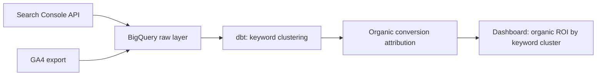

# SEO Performance Tracker

Pulls Search Console data into the warehouse and joins it against actual conversions, so organic performance gets measured by revenue impact, not just impressions and clicks.

## The problem this solves

Search Console tells you what's ranking, GA4 tells you what's converting, and almost nobody joins the two. This means organic traffic usually gets judged on volume alone, when the real question is which keywords and pages are actually driving pipeline.

## Architecture

## What's in here

* `python/gsc_extract.py` pulls query, page, click, and impression data from the Search Console API on a rolling window
* `sql/organic_conversion_attribution.sql` joins Search Console landing pages against GA4 conversion events to attribute revenue back to the keywords that drove it

## How it's used in practice

Search Console data alone can't tell you if a keyword matters to the business, a page ranking well for a high volume but irrelevant term looks great in isolation and means nothing for revenue. Joining against GA4 conversions on landing page and session date turns a list of rankings into a list of what's actually working, which is what actually gets reported on rather than raw traffic numbers.

## Stack

Python, Google Search Console API, BigQuery, GA4, dbt
